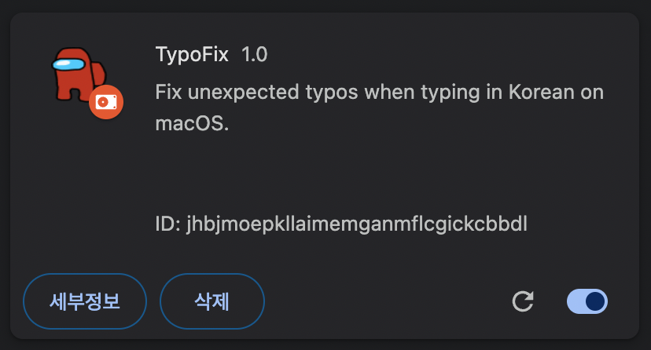

# TypoFix

- [데모](#데모)
- [설치](#설치)
- [사용법](#사용법)
- [함께 읽기](#함께-읽기)

macOS 유저가 GitHub에서 PR을 한국어로 작성하다보면 이상한 특수문자가 입력되는 성가신 현상이 있습니다. 이를 해결하는 크롬 확장 프로그램입니다.

## 데모

https://github.com/datalater/typo-fix/assets/8105528/48735a16-23db-480f-bd1f-5c2863c24ab2

## 설치

**01 프로젝트를 다운로드합니다.**

```
git clone https://github.com/datalater/typo-fix.git
```

**02 Chrome 브라우저에서 `chrome://extensions/`로 이동합니다.**

**03 `압축해제된 확장 프로그램을 로드합니다.` 버튼을 눌러서 `typo-fix` 디렉토리를 선택합니다.**

> [!NOTE]
>
> 설치에 어려움이 있다면 [공식 가이드](https://developer.chrome.com/docs/extensions/get-started/tutorial/hello-world?hl=ko#load-unpacked)를 참조해주세요.

<details markdown="1">
<summary><strong>설치가 완료된 화면</strong></summary>



</details>

## 사용법

GitHub URL에서 PR을 작성할 때 이상한 특수문자가 입력되더라도 작성 버튼을 누르면 자동으로 제거됩니다.

이미 이상한 특수문자가 입력되어 있는 경우에도 수정 버튼을 누르면 자동으로 제거됩니다.

## 함께 읽기

이상한 특수문자가 입력되는 이슈 제보:

- https://github.com/microsoft/vscode/issues/148356
- https://github.com/microsoft/vscode/issues/171388
- https://jybaek.tistory.com/954

크롬 확장 만드는 법:

- [Chrome for Developers - 모든 페이지에서 스크립트 실행](https://developer.chrome.com/docs/extensions/get-started/tutorial/scripts-on-every-tab?hl=ko)
- [GoogleChrome/chrome-extensions-samples: images](https://github.com/GoogleChrome/chrome-extensions-samples/tree/main/functional-samples/tutorial.reading-time/images)

PNG 이미지를 아이콘으로 변환하기:

- https://pixlr.com/kr/express/
- https://www.iloveimg.com/resize-image/resize-png#resize-options,pixels
